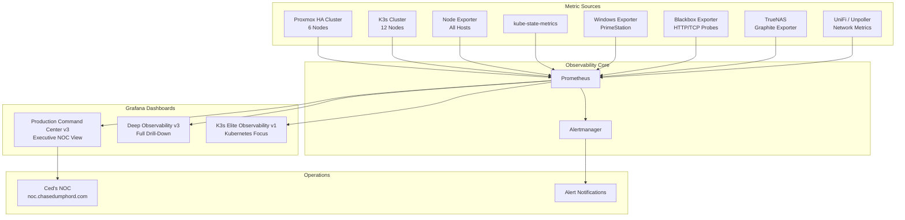
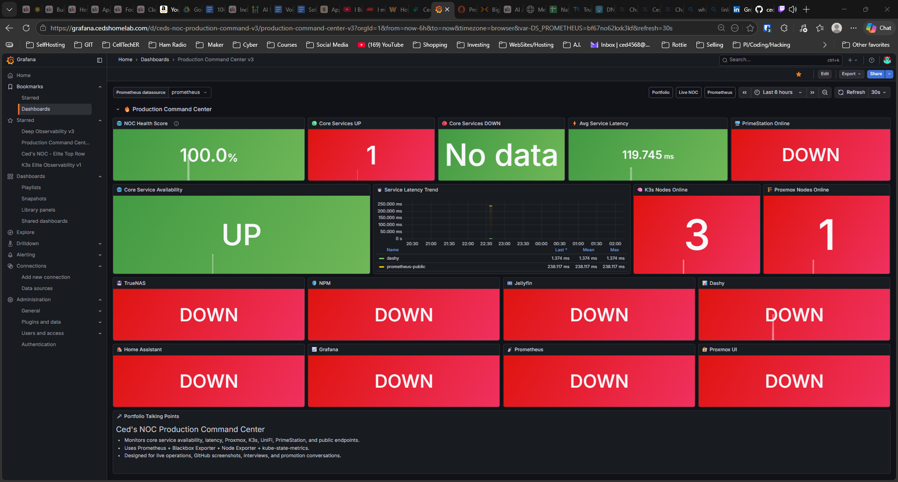
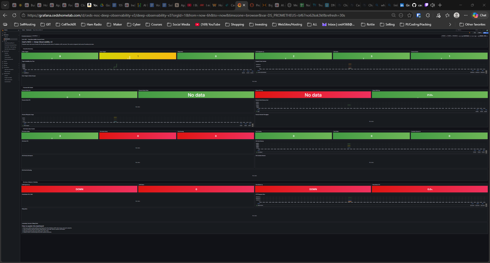
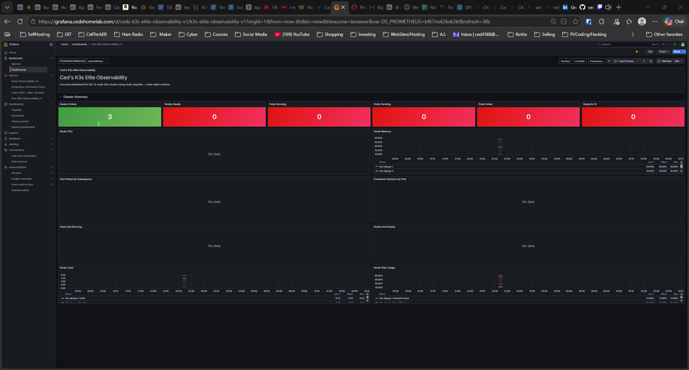

# Ced's Observability Stack — Production Monitoring Platform

> A production-style observability platform delivering full-stack visibility across a hybrid homelab infrastructure — Proxmox HA cluster, 12-node K3s cluster, network gear, storage, and edge systems. Built on Prometheus, Grafana, and Alertmanager with live dashboards running 24/7.

[](#production-dashboards)
[](https://grafana.cedshomelab.com)
[](#stack)
[](https://noc.chasedumphord.com)
[](https://chasedumphord.com)

---

## What This Is

This is the observability layer for Ced's HomeLab — the system that answers the question: *"Is everything actually working?"*

It collects metrics from every layer of the infrastructure stack, visualizes them in purpose-built Grafana dashboards, and routes alerts through Alertmanager when something breaks. Three production dashboards serve different operational needs — an executive NOC view for quick status checks, a deep drill-down dashboard for troubleshooting, and a dedicated K3s cluster dashboard for Kubernetes visibility.

This isn't a demo. Prometheus is actively scraping targets. Grafana is displaying live data. The dashboards have been through real incidents and refined based on what actually matters during an outage.

---

## Architecture



---

## Production Dashboards

Three purpose-built dashboards serving different operational needs. All live at `grafana.cedshomelab.com`.

### Production Command Center v3

Executive NOC view for quick infrastructure status checks. Designed for portfolio demonstrations, interviews, and daily operational awareness.



**What it shows:**
- NOC Health Score — single number representing overall infrastructure health
- Core Services UP / DOWN counters
- Average service latency with trend graph
- PrimeStation online status
- Core Service Availability (UP/DOWN)
- Service Latency Trend over time
- K3s Nodes Online / Proxmox Nodes Online
- Per-service status tiles: TrueNAS, NPM, Jellyfin, Dashy, Home Assistant, Grafana, Prometheus, Proxmox UI

**Built for:** Portfolio presentations, interview demos, daily ops check

---

### Deep Observability v3

Full drill-down dashboard for active troubleshooting and infrastructure analysis. Covers every layer of the stack in one view.



**What it shows:**
- Prometheus target health summary
- Proxmox HA cluster metrics — nodes, storage, VM status
- K3s cluster health — nodes, pods, deployments
- Windows/Network/Backup section — PrimeStation, UniFi, TrueNAS
- HTTP/TCP probe results via Blackbox Exporter
- HTTPS response time trends

**Built for:** Active incident response, performance analysis, infrastructure troubleshooting

---

### K3s Elite Observability v1

Focused Kubernetes dashboard using node-exporter and kube-state-metrics for deep cluster visibility.



**What it shows:**
- Cluster Summary: Nodes Online, Nodes Ready, Pods Running, Pods Pending, Pods Failed, Restart count
- Node CPU usage per node
- Node Memory usage with historical trend
- Pod Phase by Namespace
- Container Restarts by Pod
- Pods Not Running
- Nodes Not Ready
- Node Load average
- Node Disk Usage

**Built for:** Kubernetes operations, cluster health monitoring, capacity planning

---

## Full Exporter Stack

Every metric source in the infrastructure is actively scraped by Prometheus.

| Exporter | Target | Metrics |
|----------|--------|---------|
| Node Exporter | All Proxmox + K3s nodes | CPU, RAM, disk, network per host |
| kube-state-metrics | K3s cluster | Pod state, deployment health, replica counts |
| Proxmox Exporter | Proxmox HA cluster | Node status, VM health, HA state |
| Windows Exporter | PrimeStation | CPU, RAM, disk, network for main workstation |
| Blackbox Exporter | HTTP/TCP endpoints | Service uptime, response time, probe results |
| TrueNAS Graphite Exporter | TrueNAS | Storage pool health, dataset usage |
| Unpoller (UniFi Exporter) | UniFi Dream Router | Network device metrics, client counts, throughput |
| metrics-server | K3s | Real-time resource usage for kubectl top |

---

## Infrastructure Coverage

| System | Monitoring Status |
|--------|------------------|
| Proxmox HA Cluster (6 nodes) | ✅ Live — node exporter + Proxmox exporter |
| K3s Cluster (12 nodes) | ✅ Live — node exporter + kube-state-metrics |
| TrueNAS | ✅ Live — Graphite exporter |
| Nginx Proxy Manager | ✅ Live — Blackbox HTTP probe |
| Home Assistant | ✅ Live — Blackbox HTTP probe |
| Dashy | ✅ Live — Blackbox HTTP probe |
| Jellyfin | ✅ Live — Blackbox HTTP probe |
| UniFi Dream Router | ✅ Live — Unpoller exporter |
| PrimeStation (Windows) | ✅ Live — Windows exporter |
| Grafana | ✅ Live — self-monitored |
| Prometheus | ✅ Live — self-monitored |
| Public endpoints | ✅ Live — Blackbox external probes |

---

## Repository Structure

```
ceds-observability-stack/
├── architecture/           # Architecture diagrams
├── prometheus/
│   └── prometheus.yml      # Scrape configs and target definitions
├── grafana/
│   └── dashboards/         # Dashboard JSON exports
├── exporters/              # Exporter configs (node, blackbox, unpoller)
├── alerting/               # Alertmanager config and alert rules
├── scripts/
│   └── service-health-check.py
└── docs/                   # Setup guides and notes
```

---

## Quick Start

**Prerequisites:** Linux server or VM, Prometheus, Grafana, network access to homelab systems.

```bash
# Run Prometheus with config
prometheus --config.file=prometheus/prometheus.yml

# Verify targets are up
# Navigate to: http://localhost:9090/targets

# Run service health check script
python3 scripts/service-health-check.py
```

**Access:**
- Prometheus: `http://<server-ip>:9090`
- Grafana: `http://<server-ip>:3000`
- Live (external): `https://grafana.cedshomelab.com`

---

## Roadmap

### Completed
- [x] Prometheus running and scraping all targets
- [x] Grafana connected to Prometheus datasource
- [x] Proxmox node exporters reporting
- [x] K3s node exporters reporting across all 12 nodes
- [x] kube-state-metrics installed and reporting
- [x] Windows Exporter on PrimeStation
- [x] Blackbox Exporter — internal HTTP/TCP probing
- [x] UniFi Exporter via Unpoller
- [x] TrueNAS Graphite Exporter
- [x] Production Command Center v3 — live
- [x] Deep Observability v3 — live
- [x] K3s Elite Observability v1 — live

### In Progress
- [ ] Alertmanager alert rules library
- [ ] Alert notification channels (email / Discord)
- [ ] Loki log aggregation
- [ ] Grafana public demo dashboard
- [ ] Tempo distributed tracing
- [ ] GitOps deployment via ArgoCD
- [ ] Automated remediation (self-healing infrastructure)
- [ ] Cloudflare Access log ingestion
- [ ] Multi-cluster Kubernetes monitoring

---

## Related Projects

| Project | Role in Stack |
|---------|--------------|
| [ceds-homelab](https://github.com/ced4568/ceds-homelab) | Infrastructure layer — Proxmox, TrueNAS, networking |
| [ced-k3s-homelab](https://github.com/ced4568/ced-k3s-homelab) | Orchestration layer — 12-node K3s cluster |
| [ceds-aprs-igate](https://github.com/ced4568/ceds-aprs-igate) | Edge layer — RF ingestion nodes |
| [ced-portfolio](https://github.com/ced4568/ced-portfolio) | Portfolio — chasedumphord.com |

---

## Author

**Chase Dumphord (Ced)**
Digital Systems Engineer · GE Aerospace · Oxford, MS

[](https://chasedumphord.com)
[](https://www.linkedin.com/in/chase-dumphord/)
[](https://github.com/ced4568)
[](https://grafana.cedshomelab.com)
[](https://noc.chasedumphord.com)