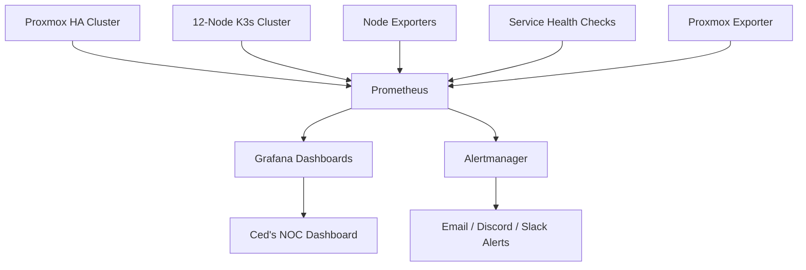

# 🚀 Ced’s Observability Stack


---

## 🧠 Executive Summary

**Ced’s Observability Stack** is a production-style monitoring, metrics, and alerting platform built to provide full visibility into a distributed hybrid infrastructure.

It simulates real-world **SRE / Platform Engineering environments**, delivering:

* 📊 Real-time infrastructure monitoring
* ⚙️ Kubernetes observability (12-node K3s cluster)
* 🖥️ Proxmox HA cluster visibility
* 🌐 Service uptime + network health tracking
* 🚨 Alerting pipelines (Alertmanager)
* 📈 Operational dashboards (Grafana)

> 🎯 **Goal:** Demonstrate enterprise-level observability practices across virtualization, Kubernetes, and self-hosted infrastructure.

---

## 🏗️ Environment Overview

### Core Infrastructure

| System                   | Purpose                            |
| ------------------------ | ---------------------------------- |
| 🖥️ Proxmox HA Cluster   | Virtualization & high availability |
| ☸️ K3s Cluster (12-node) | Container orchestration            |
| 💾 TrueNAS               | Storage services                   |
| 🌐 Nginx Proxy Manager   | Reverse proxy & routing            |
| ☁️ Cloudflare            | DNS, tunnels, external protection  |
| 📊 Grafana               | Visualization dashboards           |
| 📡 Prometheus            | Metrics collection                 |
| 🚨 Alertmanager          | Alert routing                      |

---

## 🚀 Quick Start

### Prerequisites

- Linux server or VM
- Python 3 installed
- Prometheus installed
- Grafana installed
- Network access to homelab systems

---

### Run Service Health Check

bash python3 scripts/service-health-check.py 

---

### Run Prometheus

bash prometheus --config.file=prometheus/prometheus.yml 

---

### Access Services

- Prometheus: http://localhost:9090
- Grafana: http://localhost:3000

---

## 📡 Monitored Systems

| Target                  | Example Metrics                      |
| ----------------------- | ------------------------------------ |
| 🖥️ Proxmox Nodes       | CPU, memory, storage, VM + HA status |
| ☸️ K3s Nodes            | Node readiness, resource usage       |
| 📦 Kubernetes Workloads | Pods, deployments, restarts          |
| 🌐 Network Services     | Uptime, latency, TCP checks          |
| 💾 TrueNAS              | Storage + service availability       |
| 🔀 Nginx Proxy Manager  | Reverse proxy health                 |
| 📊 Dashy / NOC          | Dashboard availability               |
| 🎬 Jellyfin             | Media service uptime                 |

---

## 🧩 Architecture



---

## 📸 Dashboards

### Infrastructure Overview
Infrastructure Dashboard

### K3s Cluster Dashboard
K3s Dashboard

### Proxmox HA Dashboard
Proxmox Dashboard

### Service Uptime Dashboard
Services Dashboard

---

## ⚙️ Core Components

### 📡 Prometheus

Collects metrics from:

* Kubernetes endpoints
* Node exporters
* Proxmox exporter
* Custom health scripts
* Static service targets

---

### 📊 Grafana

Provides dashboards for:

* Cluster health
* Resource utilization
* Storage trends
* Service uptime
* Alert visibility

---

### 🚨 Alertmanager

Handles alerting for:

* Node failures
* High CPU / memory
* Service outages
* Pod crash loops
* Proxmox HA issues

---

## 📁 Repo Structure

```
ceds-observability-stack/
├── architecture/
├── prometheus/
├── grafana/
├── exporters/
├── alerting/
├── scripts/
└── docs/
```

---

## 📸 Dashboard Preview (Add Your Screenshots)

> 📌 Replace with real screenshots from your Grafana dashboards

* 🔹 Infrastructure Overview
* 🔹 K3s Cluster Health
* 🔹 Proxmox Cluster Status
* 🔹 Service Uptime Dashboard

---

## 🚀 Deployment (High-Level)

```bash
# Clone repo
git clone https://github.com/ced4568/ceds-observability-stack.git

# Navigate to project
cd ceds-observability-stack

# Deploy Prometheus + exporters
# (Add your actual deployment steps here)

# Access Grafana
http://<your-server-ip>:3000
```

---

## 🎯 Project Roadmap

### Phase 1 — Foundation

* [x] Architecture design
* [x] Repo structure
* [ ] Prometheus base config
* [ ] Grafana datasource

### Phase 2 — Metrics Collection

* [ ] Node exporter
* [ ] K3s metrics
* [ ] Proxmox exporter
* [ ] Uptime checks

### Phase 3 — Dashboards

* [ ] Infrastructure dashboard
* [ ] K3s dashboard
* [ ] Proxmox dashboard
* [ ] Service uptime dashboard

### Phase 4 — Alerting

* [ ] Alertmanager setup
* [ ] Alert rules
* [ ] Notification testing

### Phase 5 — Portfolio Polish

* [ ] Screenshots
* [ ] Architecture diagrams
* [ ] Setup guide
* [ ] Troubleshooting docs

---

## 🧠 Skills Demonstrated

* 📊 Infrastructure Monitoring
* ☸️ Kubernetes Operations
* 📡 Prometheus Configuration
* 📈 Grafana Dashboarding
* 🚨 Alert Engineering
* 🐧 Linux Administration
* 🖥️ Proxmox Virtualization
* ⚙️ SRE Principles
* 🏗️ Platform Engineering

---

## 🔗 Related Projects

| Project           | Purpose                           |
| ----------------- | --------------------------------- |
| Ced’s HomeLab     | Full infrastructure ecosystem     |
| Ced’s NOC         | Visualization + status dashboards |
| Ced’s K3s HomeLab | Kubernetes architecture           |
| Ced’s APRS iGate  | Networking + RF integration       |

---

## 📌 Status

🟢 **Active Development**

This project is continuously evolving as part of Ced’s HomeLab ecosystem and professional portfolio.

---

## 💼 Why This Project Matters

This repository demonstrates the ability to:

* Design and operate **distributed systems**
* Implement **observability at scale**
* Build **production-style monitoring stacks**
* Apply **real-world SRE practices**

> 🚀 Designed as a **portfolio-grade project** for career growth, promotion, and technical leadership visibility.
